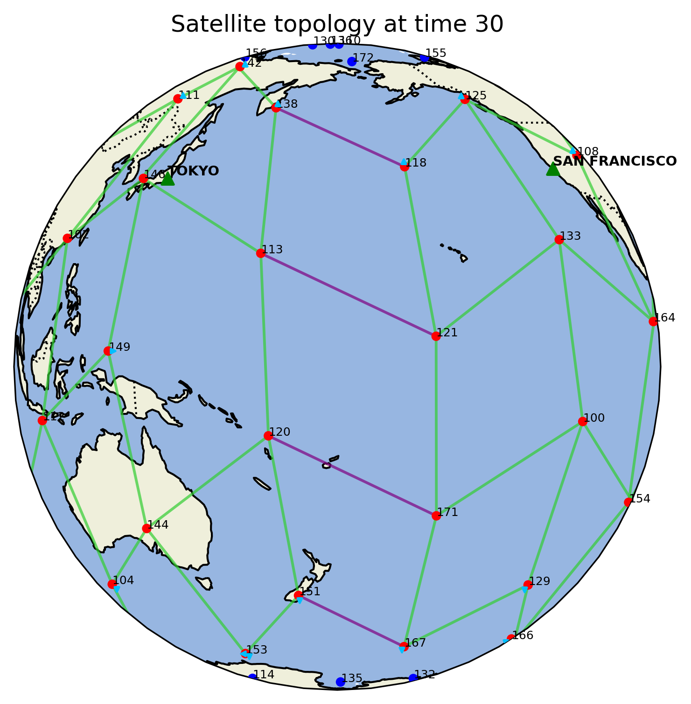

# Custom environment for RL4CC library implementation for routing on satellite networks

## Main content & Requirements

This repository provides a custom Reinforcement Learning environment ([RL4CC](https://github.com/FFede0/RL4CC/tree/main)) optimized for satellite network routing, alongside telemetry and validation utilities.

To execute this implementation, the RL4CC repository must be coupled with the custom environment configuration files. The main content of the repository is organized as follows:


``` bash
/repo folder
├── RL4CC-main/
│   └── RL4CC
│       └── callbacks
│           └── sat_callbacks.py # custom callbacks file
├── plot_utils/                  # With utilities    
├── results/                     # Where the execution results are saved
├── main.py                      # Primary execution entry point for the container
├── src/
│   ├── __init__.py
│   └── sat_environment.py       # Custom RL environment file
│   
├── Dockerfile
├── README.md
├── requirements.txt             # System dependencies
├── exp_config.json              
├── env_config.json
├── ray_config.json
├── tune_config.json
├── flows_src__dst_timeline.json # Flows dataset for agent training
├── flows_eval.json              # 10 manual/randomly sampled evaluation flows
├── satellite_topology.json      # Tracking satellites status per timestamp
└── dijkstra_results.json
```

The custom environment file `sat_environment.py` instantiates the environment logic to handle the agent behavior to select the next satellite for the step and define both the observation and action space, with a function to manage the rewards for the step and destination with various configurations.

`satellite_topology.json` contains the satellite topology/status for each timestap and `flows_src__dst_timeline.json` has the flows used for the training (from which 10 flows were manually and randomically extracted to create `flows_eval.json` used for the evaluation/validation) both are generated from a discrete event simulator paired with a traffic matrix generator.

---

From the simulator two files: `environment.py` and `satellite.py`, have been customized by adding plot and log to better understand its functioning and finally to generate the topology and flows files, furthermore the generation of satellites links was corrected to avoid assigning the same satellite multiple times as a neighbor of a single satellite.

Here the changes and istruction to generate the topology and flows files:
(the traffic generator must be pulled up first).

**Traffic Generator**
- Inside the generator `traffic_matrix_generator/` folder the requirements.txt has been changed 

```bash
numpy 1.26.2 (from 1.26.1)
```
And inside the dockerfile the python version of the simulator to `3.13.9`

- To start the traffic generator container run inside `satellite_routing/` folder, where there is the `docker-compose.yaml`
```bash
docker compose up
```

**Simulator**

- Create an solated virtual environment called “simvenv”
```bash
py -3.13 -m venv simvenv
```
- Activate it
```bash
simvenv\Scripts\activate
```
 - Now use command as specified in the simulator README (it's a bit different to manage to have enough topologies for our use)

```bash
 python main.py --strategy 5 --duration 1200 --traffic 20
```

After running the simulator, inside the folder should be generated two files, `flows_src__dst_timeline.json` and `satellite_topology.json`, these are necessary to run the RL4CC instance with the custom environment.

To do so inside the folder of the custom environment where there is the `Dockerfile` use these commands to build and start the docker image:

```bash
# Build the image
docker build -t rl4cc .

# Launch the container with evaluation metrics mapped to local results folder
docker run --rm -it --volume ./results:/root/ray_results rl4cc

```
After the execution inside the the `results/` folder there should be a new `DQN_SatEnvironment_<timestamp>/` subfolder with all the output files.

---

## Utilities folder

Inside the utils folder, files are organized into subfolders based on their specific use cases:
``` bash
plot_utils/
│
├── sat_check_duplicates/
│   └── check_neighbors.py       # Debugging check for duplicate satellite neighbors
│  
├── sat_dijkstra/
│   ├── sat_dijkstra.py          # Computes shortest-path via Dijkstra
│   ├── mean_distance.py         # Plots average hop distances per timestamp
│   └── dijkstra_hop_number.py   # Renders hop count node metric distributions
│
├── sat_plot_topology/
│   ├── distance.py              # WGS84 distance validator
│   ├── plot_connections.py      # Plots global 2D topology map
│   ├── make_animation.py        # Combines sequences of images into animated .gif
│   ├── plots_full/              # Contains results from the "full" option execution
│   ├── plots_single/            # Contains results when specifying a specific "time" step
│   └── topology_animation.gif   # Generated output of make_animation.py
│
├── sat_plot_csv/
│   ├── report_pipeline_multiplo.bat    # Orchestrates log translation execution chains
│   ├── json_to_csv.py                  # Evaluation file parsing helper
│   ├── csv_filter.py                   # Training progress parsing helper
│   └── csv_dati.py                     # Generates aggregate tables and text reports
│
├── sat_plot_summary/
│   ├── summaries_csv/                    # Destination for target csv files
│   ├── plots/
│   └──  summary_csv_plot_media_mobile.py  # Generates plots inside /plots using data from summaries_csv/
│ 
├── sat_reward_review/ 
│   ├── reward_review.py                    # Evaluates Dijkstra performance boundaries over custom rewards
│   ├── reward_review_heuristic.py          # Evaluates euristic routing agent over custom rewards
│   ├── report_reward_jumps.csv
│   └── report_reward_jumps.json
│

# Files used as input of the utilities
│
├── satellite_topology.json
├── flows_src__dst_timeline.json
├── flows_eval.json
└── dijkstra_results.json

results/                        #Located at the same hierarchical level as plot_utils
└── DQN_SatEnvironment_<timestamp>/
    ├── evaluations.json
    └── progress.csv
    # (Other files exist here, but focus is placed on evaluations and progress)

``` 

1. sat_check_duplicates

Contains `check_neighbors.py`, which scans `satellite_topology.json`to verify no satellite has been assigned to the exact same neighbor more than once.

**Note**: This was utilized as an automated debugging check before changes were applied directly to the simulator environment file, fixing the duplication issue at the root. (Optional, Debugging)

---
2. sat_dijkstra

Contains three scripts used for debugging and to calculate shortest-path routing used as baseline: 

**`mean_distance.py`**: Used for debugging, as it generate a `topology_report.json`(using `satellite_topology.json`) with the average distance of an hop and the total number of active links for every timestamp. (Optional, Debugging)

sample file view:
```json
[
    {
        "time": 0,
        "hop_mean_distance_km": 3392.736,
        "active_links_count": 84
    },
    {
        "time": 10,
        "hop_mean_distance_km": 3389.29,
        "active_links_count": 85
    },
    {
        "time": 20,
        "hop_mean_distance_km": 3381.594,
        "active_links_count": 85
    },
    {
     "..." // additional entries   
    }
]    
```

**`sat_dijkstra.py`**: Calculates the shortest path via Dijkstra's algorithm for every flow within `flows_src__dst_timeline.json`(with all the flows, not yet extracted those for `flows_eval.json`) using the timestamp topologies from `satellite_topology.json`. It generate `dijkstra_results.json` that contains the following data for every flow: 
- Timestamp, 
- Flow ID, 
- Source/destination satellite IDs, 
- Explicit hop path sequence performed by Dijkstra's algorihm
- Total path distance in kilometers.

Users can compute paths for a single specific timestamp or for ALL of them, and the resulting file is then used by the custom RL4CC satellite environment.

sample file view:
``` json

[
  {
    "time": 0,
    "flow_id": 719125,
    "start_id": 146,
    "end_id": 152,
    "path": [
      146,
      113,
      121,
      133,
      164,
      152
    ],
    "distance_km": 18782.300426781818
  },
  {
    "time": 0,
    "flow_id": 801121,
    "start_id": 146,
    "end_id": 122,
    "path": [
      146,
      102,
      "..." // additional entries 
    ]
  }
]
```  

**`dijkstra_hop_number.py`**: Reads `dijkstra_results.json` to output a chart illustrating the total percentage distribution of optimal path lengths, measured as number of elements in the path (nodes).


---
3. sat_plot_topology

Contains some debugging and visualization utilities used to study the topology configurations employed:

**`distance.py`**: calculates and prints the geometric distance, using WGS84 ellipsoid standard, between two satellites by manually specifying their latitude and longitude coordinates in the code. (Optional, Debugging)

The **`plot_connections.py`** script uses `satellite_topology.json` to generate 2D world projection maps with the corresponding topology for a specific "timestamp", showing the satellites and their links, doing a distintion between active and inactive ones and the ones intersecting the International Date Line (IDL, or 180th meridian) as well drawing ground stations.
There's the option to specify a precise timestamp to plot or use "full" option to print all the topologies of every timestamp.
(In the code there are various map format to use for the world projection)

sample image view:




**`make_animation.py`**: Unify all the image sequence generated within `plots_full/` folder into a `topology_animation.gif`.

sample image view:


---
4. sat_plot_csv (Results Processing Pipeline)

Following Docker execution, the `results/` directory contains a   `DQN_SatEnvironment_<timestamp>/` subfolder with all the output files from the executed environment, from there we are interested in :
- `evaluations.json`: Evaluation tracking statistics managed by RL4CC. 
- `progress.csv`: Training metrics saved at each iteration step.

These files contains useful information as specified in the `sat_callbacks.py` file, more details of how the callbacks work are available in the documentation of [RL4CC](https://github.com/FFede0/RL4CC/tree/main) repository

The scripts within `sat_plot_csv` manage, parse, and clean these raw logs via **`report_pipeline_multiplo.bat`**:

The batch script prompts the user to select either Evaluation or Training data: `[json/csv]` and use the results paths specified in the code to generated other useful files.
To maintain clean modularity and simplify debugging, execution tasks are broken into separate helper scripts:
In the first case it use `(A)json_to_csv.py` and then `(C)csv_dati.py`, instead for the training it uses `(B)csv_filter.py` and then `(C)csv_dati.py`

Where:

- **`json_to_csv`** converts the `evaluations.json` in a filtered csv with only the data of interest, from the specified flows used for the evaluations. (EVALUATION) 

- **`csv_filter`** filter the `progress.csv` in a filtered csv with only the data of interest, from the flows used for the training. (TRAINING)

- **`csv_dati`** take the filtered csv resulted from both previous options and produce an overview report `report.txt` structured as a table with various metrics for each episode, where each row is a single evaluated flow at a specific iteration. It also generate a `summary.csv` with the data of interest for each iteration which will then be used to generate more explanatory graphs with `summary_csv_plot_media_mobile.py`. 

 Note: (both resulting files will be in the results paths specified in the `report_pipeline_multiplo.bat` code)

Parameters of a single row:
- **ITER / EP**: Iteration and  episode index of the selected flow.
- **HOLES**: Counter indicating if an agent stalled for too long (at a maximum of 5 non-consecutive stalled steps).
- **DISTANCE / DIJK_DIST**: Total distance covered by the agent vs the absolute shortest path from Dijkstra.
- **DIFF_%**: Percentage deviation of the agent's path compared to Dijkstra.
- **DEST_OK**: Binary flag showing whether the agent has successfully reached the destination.
- **STP/30**: Total hop count accumulated against the maximum limit of 30 steps.
- **DIJK_HOP**: The optimal hop count calculated by Dijkstra.
- **LAST_R / RETURN**: The final step reward (indicating arrival success) and total accumulated episodic return.
- **MIN_R / MAX_R / MEAN_R / STD_R**: Statistical values of rewards across the episode.

Above the actual row values, a summary block aggregates performance indicators per iteration (averaging 10 episodes for evaluations, or a variable count for training runs):
- Percentage (%) of successfully completed flows.
- Percentage (%) of strictly optimal routes (0% error).
- Percentage (%) of acceptable routes fitting within fixed error thresholds (10%, 20%, 30%, 40%, 50%).
- Average percentage deviation from Dijkstra across all processed flows.
- Reward tracking metrics (Mean, Min, Max) alongside overall episode counts.

report.txt preview:
``` plaintext
--------------------------------------------------------------------------------------------------------------------------------------------------------------
ITER   | EP  | HOLES | DISTANCE   | DIJK_DIST  | DIFF_%   | DEST_OK | STP/30  | DIJK_HOP | LAST_R     | RETURN     | MIN_R    | MAX_R    | MEAN_R   | STD_R   
--------------------------------------------------------------------------------------------------------------------------------------------------------------
ITER 1:  Concluded flows:  20.00% | Optimal route:   0.00% | Ptc Err:  10.00%, 10.00%, 10.00%, 10.00%, 10.00% | Avg Deviat from Dijk:  86.79% |
Reward (Mean/Min/Max): -3.767/-5.0488/1.1815 | EP count: 10
--------------------------------------------------------------------------------------------------------------------------------------------------------------
1      | 1   | 0     | 20573.00   | 7604.62    |  170.53% | 1       | 6       | 2        | 1.0000     | 0.9716     | -0.0333  | 1.0000   | 0.1619   | 0.3755  
1      | 2   | 0     | 25573.36   | 24817.30   |    3.05% | 1       | 7       | 7        | 1.0000     | 1.1815     | 0.0148   | 1.0000   | 0.1688   | 0.3394  
1      | 3   | 5     | 3627.57    | 13533.60   |    -     | 0       | 6       | 4        | -1.0000    | -4.9915    | -1.0000  | 0.0085   | -0.8319  | 0.3758  
1      | 4   | 5     | 13799.61   | 18888.33   |    -     | 0       | 9       | 5        | -1.0000    | -4.9810    | -1.0000  | 0.0190   | -0.5534  | 0.4993  
1      | 5   | 5     | 3642.70    | 7604.62    |    -     | 0       | 6       | 2        | -1.0000    | -4.9800    | -1.0000  | 0.0200   | -0.8300  | 0.3801  
1      | 6   | 5     | 10815.14   | 15091.09   |    -     | 0       | 9       | 5        | -1.0000    | -4.8919    | -1.0000  | 0.0333   | -0.5435  | 0.5104  
1      | 7   | 5     | 2816.74    | 6459.46    |    -     | 0       | 6       | 2        | -1.0000    | -4.9667    | -1.0000  | 0.0333   | -0.8278  | 0.3851  
1      | 8   | 5     | 2955.80    | 20965.81   |    -     | 0       | 6       | 7        | -1.0000    | -4.9837    | -1.0000  | 0.0163   | -0.8306  | 0.3787  
1      | 9   | 5     | 3642.68    | 7584.91    |    -     | 0       | 6       | 2        | -1.0000    | -4.9797    | -1.0000  | 0.0203   | -0.8299  | 0.3802  
1      | 10  | 5     | 16818.18   | 11283.71   |    -     | 0       | 10      | 3        | -1.0000    | -5.0488    | -1.0000  | 0.0079   | -0.5049  | 0.4953  
==============================================================================================================================================================

```


---
5. sat_plot_summary

Utilizes the generated outputs from `csv_dati.py` (via the .bat pipeline) to plot trend lines and performance curves over time:

**`summary_csv_plot_media_mobile.py`**: Reads the data moved into `summaries_csv/` that can be renamed as you like while using the same name inside the script code in the "files_to_plot" list and set the styles with "file_styles" dict. There are some parameters to set a customizable moving average window to smooth plotted curves along the X-axis (Execution Iterations) for differents type of graphs. 
It outputs several performance graphs inside `plots/` folder:

- **concluded_plot**: Percentage of completed flows per iteration, where the single value is the percentage(%) of concluded flows among the 10 flows of the iteration.

- **deviation_plot**: Average path distance deviation percentage compared to Dijkstra, with standard deviation, mininum and maximum.

- **err0_optimal_plot** to **err50_plot**: Percentage of routes matching the optimal benchmarks within 0%, 10%, 20%, 30%, 40%, and 50% tolerance error limits, with both the mininum and maxixum.

- **max_performance_error_summary**: Peak accuracy levels achieved across every individual error threshold boundary.

- **reward_plot**: Average episodic return values plotted per iteration,  with both the mininum and maxixum.

- **Zoomed Variations**: Zoomed view focus plots for all key performance metrics listed above, the zoom center and range can be defined in the code.

---

6. sat_reward_review

Contains some verification scripts that use `satellite_topology.json`, `flows_eval.json` and `dijkstra_results.json` to validate, benchmark, and tweak the design of reward structures implemented inside the custom RL4CC satellite environment:

- **`reward_review.py`**: Computes maximum returns and total path lengths achievable using Dijkstra configurations based on various reward function, as Dijkstra is the baseline and point of reference for the development and evaluation of how close current trained RL agents are getting to optimal policy boundaries. (also to evaluate if the used reward function is good enough to reach the behavior of Dijkstra, as we have defined the reward functions, with the reached reward values)

- **`reward_review_heuristic.py`**: Simulates a heuristic routing agent that, at each hop/step of the episode, selects the immediate neighbor physically closest to the destination satellite. This comparison isolates where heuristic logic stands relative to Dijkstra, as elements of this spatial logic are embedded directly into the reward functions deployed.

**Note**: Both scripts feature a dedicated Reward code block section where you can swap out or adjust destination and step rewards to enable different reward function configurations.

The scripts execution generate two files, `report_reward_jumps.csv` and `report_reward_jumps.json`, where both contains information of validation flows by applying the logics of the reward functions: 
- The flow id 
- The starting and ending satellites id
- The time of the topology references of the current flow
- The number of hops done
- The total distance
- The total sum of rewards of this episode (return)
- The reward for every hop.

sample file view:
```json

[
    {
        "flow_uuid": 517673,
        "route": "152->133",
        "time": 10,
        "hops": 2,
        "total_distance": 7584.91,
        "total_reward": 1.08333,
        "jump_1_reward": 0.08333,
        "jump_2_reward": 1.0,
        "jump_3_reward": null,
        "jump_4_reward": null,
        "jump_5_reward": null,
        "jump_6_reward": null,
        "jump_7_reward": null,
        "jump_8_reward": null,
        "jump_9_reward": null
    },
    {
        "flow_uuid": 920228,
        "route": "133->146",
        "time": 20,
        "hops": 5,
        "total_distance": 16830.4,
        "total_reward": 0.8871,
        "jump_1_reward": 0.08333,
        "jump_2_reward": 0.08333,
        "jump_3_reward": 0.08333,
        "jump_4_reward": -0.03333,
        "jump_5_reward": 0.67044,
        "jump_6_reward": null,
        "..." // additional entries 
    }
] 
```